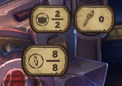
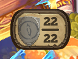

## This Plugin Is Deprecated

# C'Thun

 

[C'Thun](https://hearthstone.blizzard.com/en-gb/cards/38857-cthun) Attack/Health Counter [Hearthstone Deck Tracker](https://hsdecktracker.net/) plugin

*Works with Twist Format and [Caverns of Time](https://hearthstone.blizzard.com/en-gb/cards?set=caverns-of-time) [C'Thun](https://hearthstone.blizzard.com/en-gb/cards/102680-cthun)*

Copy of HDT internal C'Thun counter as plugin with added display configuration.

Displays [C'Thun](https://hearthstone.blizzard.com/en-gb/cards/38857-cthun) properties for both player and opponent :-

- Attack
- Health
- Taunt

Counters can be displayed for player and opponent:-

- Always
- Auto: When C'Thun is detected in play
- Never

Counter display can be modified for:-

- Position
- Scale
- Opacity

## Installation

- [Download](https://hsreplay.net/downloads/) and install the latest version of Hearthstone Deck Tracker (Windows only)
- [Download](https://github.com/batstyx/CThun/releases/latest) the latest release of Shamanic
- Right click on the `CThun-v*.zip`, go into Properties and click “Unblock” at the bottom.
- Follow the Hearthstone Deck Tracker FAQ [plugin installation instructions](https://github.com/HearthSim/Hearthstone-Deck-Tracker/wiki/Available-Plugins)
